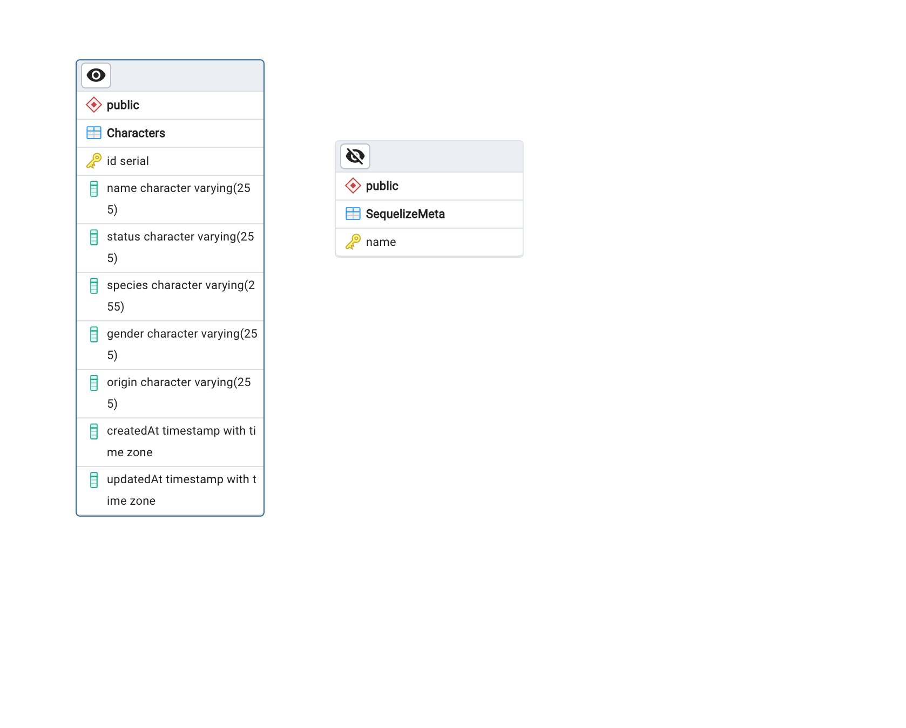

<p align="center">
  <a href="https://www.apollographql.com/docs/apollo-server" target="__blank"></a>
</p>

# Rick and Morty API

# Technologies used


# Code structure

```
app/
  ├── module/
    ├── dto/
    ├── interfaces/
    ├── resolvers/
    ├── schema/
    ├── services/
    ├── __tests__/


```

# Results

## ERD

- ERD diagram:

<p align="left">
  <a target="__blank"></a>
</p>

## How to start the app locally

# Clone Project and run it locally

1. Make sure you got docker-desktop installed on your pc
2. Clone the Repository

```
https://github.com/dasanchez11/graphql-rick-morty
```

3. Create a **.env** that has the same parameters as the **.env.example** and add environment variables
   if on docker, leave DB_HOST and REDIS_HOST as the example

```
DB_USERNAME = 'postgres'
```

4. Run the app on Docker

```
docker-compose up -d
```

5. Open the app on your web browser

```
http://localhost:4000/
```

6. If you don't have docker,

- 1. Start a postgres db
- 2. Start a redis service
- 3. map the ports in the env variables
- 4. run

```
npm run db:create
```

- 5. run

```
npm run db:migrate
```

- 6. run

```
npm run db:seed
```

- 7. run

```
npm run start
```

7. Enjoy
